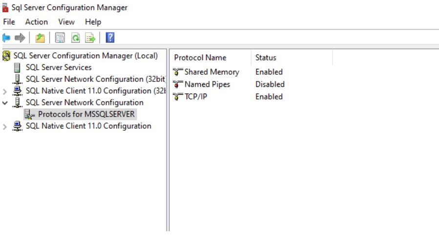
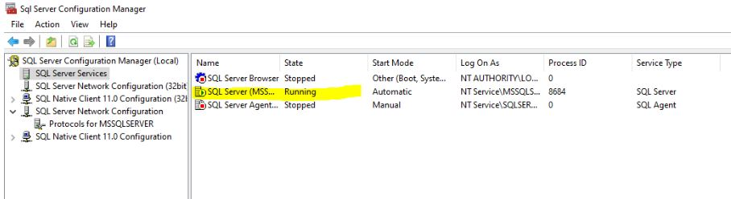
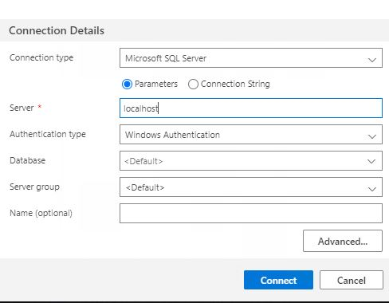
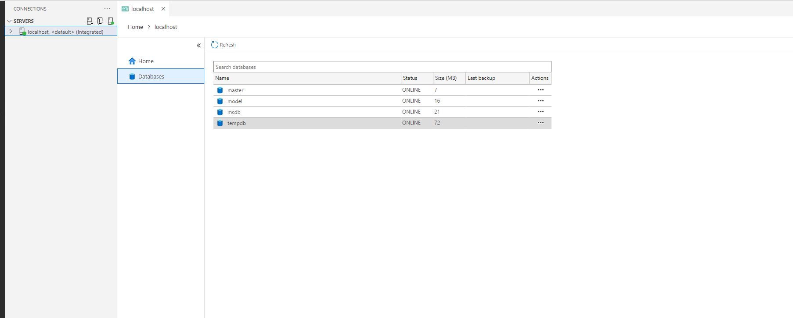

# A SECURE NODEJS REST API IS BUILT USING PRISMA AND AZURE DATA STUDIO IN PART THREE

## [Mysql configuration with prisma](prisma_mysql_workbench/QuickStart.md)

***

***

## This Nodejs REST API part three is intended to be secure and user-friendly, and it makes use of best API practices

***

The APIs could be improve over time to be more secure.

## Check out [Nodejs-REST-API-part-one uses JSON files for storage](https://github.com/rqkohistani/Build-a-Secure-Nodejs-REST-API-part-one)

## Chekc out [Nodejs-REST-API-part-two uses **mysql** for storage](https://github.com/rqkohistani/a-secure-nodejs-RESTAPI-part-two-with-mysql)

## Chekc out [Nodejs-REST-API-part-three uses **Prisma** and Mysql for storage](./prisma_mysql_workbench)

***

## Steps to run Node JS REST API part three

***

### Confingure Azure Data Studio and Prepare the database

1. [Configure Azure Data Studio download link](https://learn.microsoft.com/en-us/sql/azure-data-studio/download-azure-data-studio?view=sql-server-ver16)

    1. Platform: Windows Use installer (recommended)
    1. Install Azure Data Studio
    1. Open Azure Data Studio
    1. From Welcome tab, Click on ``Deploy a server``
    1. Select ``Sql server on Windows``
    1. version: ``SQL Server 2019``

    1. Insall ``SQL Server 2019``
        1. Select instlation type: Basic
        1. Open SQL Server Config. Manager  
        1. Navigate to “Protocols for MSSQLSERVER”
        1. Enable TCP/IP
        1. Agree to the license terms **Default**
        1. 
        1. Navigate to ``SQL Server Services``
        1. Right click on the SQL Server (MSS…). Click ``Restart``
        1. 

1. Create a connection
    1. server: ``localhost``
    1. connect
    1. 
    1. 
    1. Create a new database ``nodejsPart3Prisma``

    1. ```sql
    
        USE master
        GO
        IF NOT EXISTS (SELECT name
        FROM sys.databases
        WHERE name = N'nodejsPart3Prisma')
        CREATE DATABASE [nodejsPart3Prisma];
        GO
        USE nodejsPart3Prisma;
        GO

        ```

***

## Clone the repo

1. ```bash
    npm install
    ```

1. .env file should filled with the correct values. Check the .env.example.md file for more info.

1. ```bash
    npx prisma migrate dev --name init
    ```

1. Seed the database once or comment out the `createAdmin();
and createUser();` function in the seeding file

    ```bash
    npx prisma db seed
    ```

1. Check database to see if the data is seeded
    1. Refresh the database
    1. In dbo.user table, there should be 2 users seeded
        1. admin and user

1. npm start
1. Use postman to test the APIs

## Export the APIs collection to the Postman

1. Download the `Nodejs Rest API P3_Prisma.postman_collection.json` file on the current repo
2. Launch Postman
3. Select the import icon.
4. Upload the Nodejs Rest API P3_Prisma.postman_collection file
5. Go to auth/login and enter the username and password

6. ```json
    {
    "email": "admin@gmail.com",
    "password":"password"
    }
    ```

***

1. [Here you can check out how part two apis was used](https://github.com/rqkohistani/a-secure-nodejs-RESTAPI-part-two-with-mysql)

***

## [My linkedIn](https://www.linkedin.com/in/rashed-qazizada-1b64b68a/)
